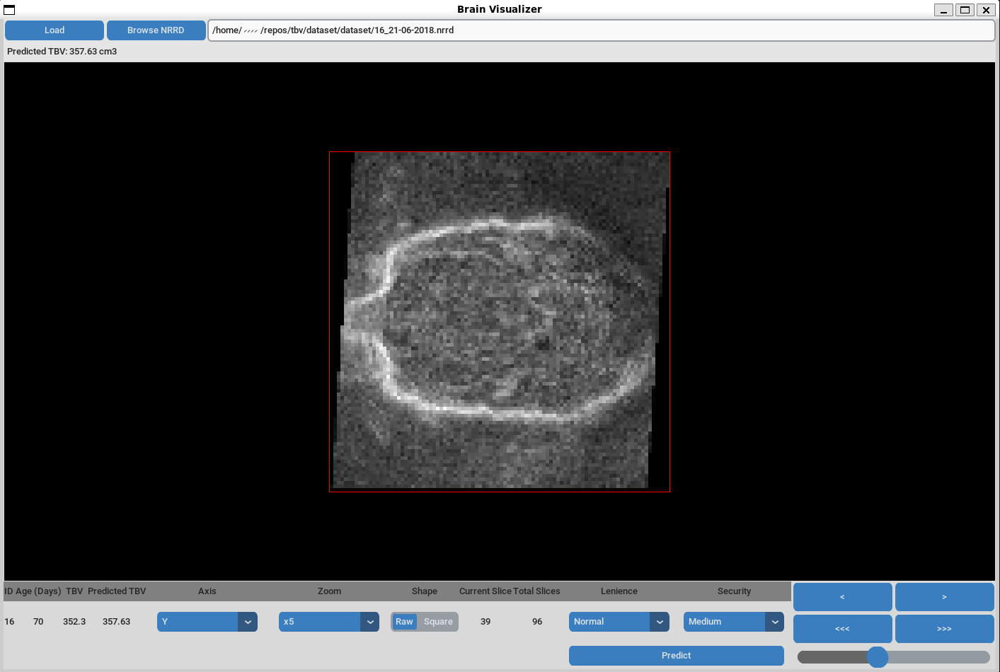
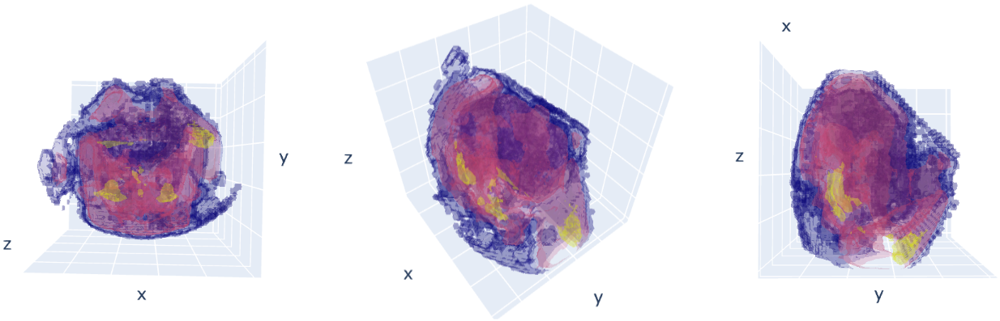
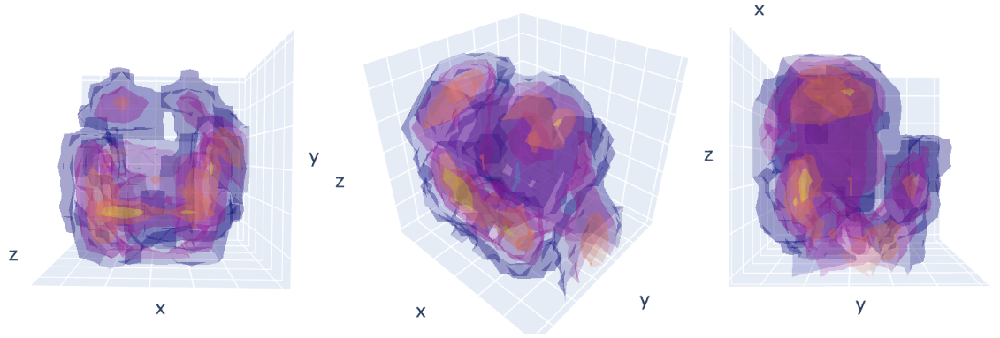
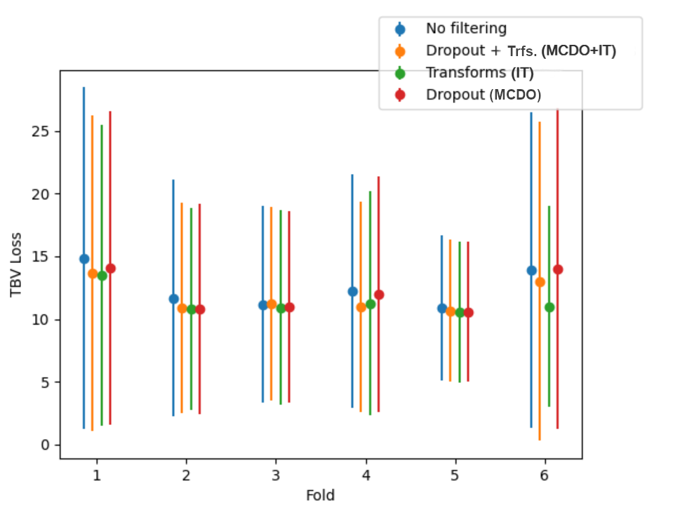

# :star: Total Brain Volume Predictor (TBV)
**Total Brain Volume (TBV)** estimation from 3D ultrasound imaging for neborn babies using safe deep learning techniques.

Features:
- :tv: Modern and easy to use GUI powered by Custom TKinter. Visualize 3D rasters and predict brain volume with 1 click.
- :brain: 30 layer 3D convolution ResNet trained on 294 brain volumes and validaded on 76 more using **PyTorch**.
- :arrow_up: 3D Data augmentation on the go using TorchIO.
- :x: Noisy or tricky 3D volumes are automatically rejected using a uncertainty representation techniques.
- :watch: Fast inference on CPU, no GPU needed. High security inference might take a few minutes, though. 

Structure:
- :file_folder: Models: All the models and architectures tested tested in the making of this project, including a tester script that benchmarks the models (measure errors).
- :file_folder: Visualizer: The final distributable program + network weights.

## :tv: User Interface

The application comprises three main sections: the navigation bar, the visualization port, and the control panel, as illustrated in the following figure.

The top navigation bar consists of three widgets:

- **Browse NRRD Button**: A button that opens a file system navigation window, allowing users to browse .NRRD files. Once a file is selected, its path is displayed in the file path field.
- **File Path Field**: A text field that shows the path of the selected file. Users can also manually type in the path for different files instead of browsing for them.
- **Load Button**: A button that loads the path currently displayed in the file path field.

The control panel, located at the bottom of the application frame, features numerous widgets that can be categorized into three groups: metadata visualization, slice and view control, and TBV prediction control. These widgets address all other functional requirements for the application:

- **Metadata Visualization**:
    - **ID Field**: Displays the identifier number or string for the patient, or 'N/A' if not available or not loaded.
    - **Age Field**: Displays the patient's age in days at the time of the scan, or 'N/A' if not available or not loaded.
    - **TBV Field**: Displays the manually measured TBV included in the raster file, or 'N/A' if not available or not loaded.
    - **Predicted TBV Field**: Displays the TBV prediction made by the integrated model, or 'N/A' if not yet computed.
    
- **View Control**:
    - **Axis Selector**: Allows users to select the axis being visualized (X, Y, or Z). By default, the X-a**xis (sagittal plane) is displayed.
    - **Zoom Selector**: Enables users to choose the zoom level for displaying slices. The default setting is x1, with options up to x5.
    - **Shape Switch**: Switches between raw view and square view of slices.
    - **Single Slice Step**: Button pair for advancing one slice in either direction of the selected axis.
    - **Fast Slice Step**: Button pair for advancing five slices in either direction of the selected axis.
    - **Slice Slider**: Slider set to the current slice being visualized. Users can view any slice of the volume by dragging the slider.
    
- **TBV Prediction Control**:
    - **Lenience Selector**: Allows users to select the acceptable amount of variance in the predictions made by the model. Options are 'Lenient', 'Normal', and 'Strict'. See the 'Uncertainty Representation' section for more details.
    - **Security Selector**: Enables users to choose how many iterations of the uncertainty representation method to perform. Options are 'High', 'Normal', and 'Low'.
    - **Predict Button**: Initiates the prediction process using the integrated model and the currently selected uncertainty configuration. All other buttons are locked until prediction ends.

## :mag: Model Interpretation

Developing a regression-based model carries with it the drawback of reduced interpretability of results, as it is not possible to know whether the user of the model can trust the predictions made by it.

We have carried out a simple interpretation test to verify the model has indeed learned to pay attention to the brain contour in the input images and not some unrelated and low quality proxy.

A Jupyter notebook in the 'dataset' folder contains the code used to extrac the following isosurface visualizations:

## :question: Uncertainty Representation

The layer analysis reveals that the developed model indeed focuses on the relevant parts of the raster scans that we tested. However, this does not give medical practitioners assurance regarding two crucial factors:
             
- The model's ability to perform accurately with all possible ultrasound images it may encounter during real-world usage.
- The reliability and accuracy of the model's predictions, even if they are based on relevant aspects of the input image.

To address these concerns we use uncertainty representations, enabling the model to autonomously detect instances in which its performance may be inadequate, potentially resulting in unsafe estimations. In other words, we use a method for identifying when an input image deviates significantly from the model's training distribution so that it can be referred to a human expert for manual estimation.

### :dart: Monte-Carlo Drop-Out (MCDO)

The state-of-the-art method for uncertainty representation is Monte Carlo Drop-Out (MCDO), which approximates uncertainty by deactivating different subsets of neurons in a network during repeated inferences. This process simulates a network ensemble where each network produces a prediction for the same input data. By examining the variance among the predictions made by this simulated ensemble, it becomes possible to infer the uncertainty of the prediction. Generally, the more variance there is, the further that particular instance is from the training distribution.

There are two configurable parameters: The number of iterations and the maximum variance allowed. The number of iterations determines how many models will be simulated as part of the ensemble. It is essential to have at least 30 iterations to maintain statistical relevance, as fewer iterations may result in inferring an incorrect distribution that does not represent the actual prediction an ensemble of infinite models would produce due to chance alone.

### :repeat: Input Transformations (IT)

Instead of MCDO, we use a unique approach that, as far as we are aware, has not been previously introduced in existing literature. Our method does not impose any constraints on the network, as the uncertainty is not generated by altering the active neurons during the inference process. Instead, it is achieved by repeatedly transforming the input data itself.

We transform the same input 3D ultrasound image using a data augmentation pipeline, producing a set of transformed input images, from which we calculate the estimated TBV and infer a posterior distribution similarly to the MCDO-based method.

We have also tested the combination of MCDO+IT, as can be seen in the following figure:

Input Transformations achieves better results for all cross-validation folds and also reduces the number of large errors (greater than 30 cm3) by more than 40%.