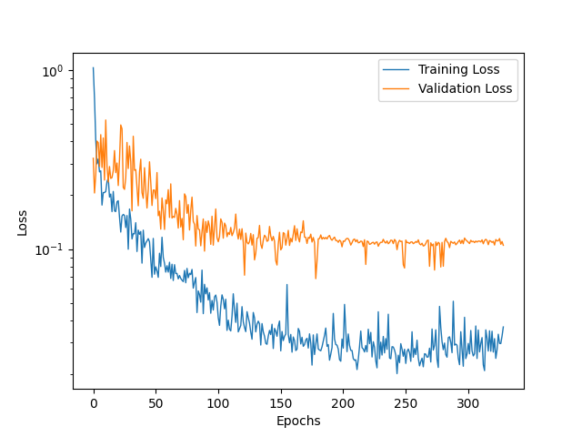

# Models

This project predicts TBV (and age) of patients with 4 different main architectures:
- Simple and shallow 3D ConvNet.
- 3D ResNet-18.
- 3D SIFT-CNN.
- Bayesian 3D Net.

Validating on patients '23', '48', '38', '1', '80', '22', '27' and '36'.
K-folds is reserved only for the final chosen architecture.

All models are trained on 1500 epochs, with a validation patience of 150 epochs. Batch size 8.

The dataset is augmented in runtime using the following pipeline:
```
tio.transforms.RandomAffine(scales=0, degrees=10, translation=0.2, default_pad_value='minimum', p=0.25),
tio.transforms.RandomFlip(axes=(0, 1, 2), flip_probability=0.2),
tio.transforms.RandomAnisotropy(axes=(0, 1, 2), p=0.2),
tio.transforms.RandomNoise(mean=0, std=0.1, p=0.2),
tio.transforms.RandomBlur(std=0.1, p=0.2),
tio.transforms.RandomBiasField(p=0.01),
tio.transforms.RandomMotion(num_transforms=2, p=0.01),
tio.transforms.RandomGhosting(num_ghosts=2, p=0.01),
tio.transforms.RandomSwap(p=0.01),
tio.transforms.RandomSpike(p=0.01)
```

---
# 3D Convolution No Age

3D convolutions and linear perceptron. Age of the patient is not used.

## Simple Net

Model has 19396225 trainable parameters

Criterion: MSE Loss
Optimizer: SGD. LR 0.001. WD 0.0005. Mo 0.9. Nesterov.
Scheduler: ReduceLROnPlateau. Mode min. Factor 0.4. Patience 10. Threshold 0.0001.
Dropout: 0.0 to 0.2. +0.01 every epoch.

Results:


## ResNet-18

Model has 33695425 trainable parameters

Criterion: MSE Loss
Optimizer: SGD. LR 0.001. WD 0.0001. Mo 0.9. Nesterov.
Scheduler: ReduceLROnPlateau. Mode min. Factor 0.5. Patience 10. Threshold 0.0001.
Dropout: 0.0 to 0.2. +0.01 every epoch.

Results:
- Average difference: 12.64 cc.
- Standard deviation: 13.42 cc.
  


## SIFT-CNN

Model has 33892993 trainable parameters

Criterion: MSE Loss
Optimizer: SGD. LR 0.001. WD 0.0005. Mo 0.9. Nesterov.
Scheduler: ReduceLROnPlateau. Mode min. Factor 0.4. Patience 10. Threshold 0.0001.
Dropout: 0.0 to 0.2. +0.01 every epoch.

Results:


---
# 3D Convolution Age

3D convolutions and linear perceptron. Age of the patient is also predicted.


---
