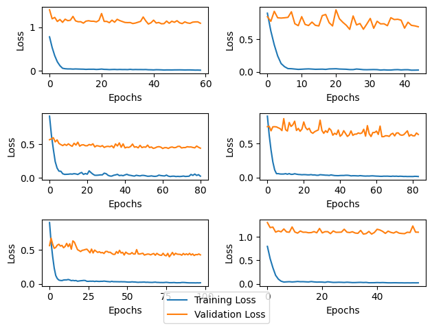
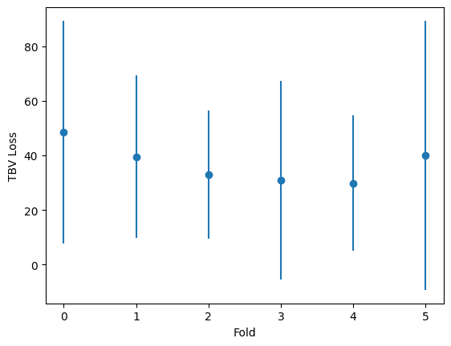
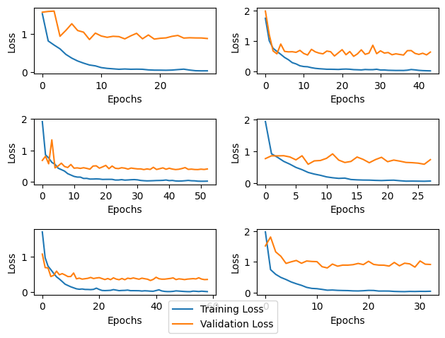

# Models

---
## Triplanar First No Age

Single triplanar layer first followed by 2D convolutions and linear perceptron. Age of the patient is not used.

#### Architecture 0

250 epochs. Validation patience of 20 epochs. No dropout.
Batch size 32. Data workers 4.

Criterion: MSE Loss
Optimizer: Adam. No decay. LR 0.0001.

Full execution: 8 Hours

##### 6-Fold cross validation training results

##### Absolute TBV loss for each fold

TBV Loss | Mean      | STD
-------- | --------- | ---------
0        | 48.554874 | 40.716999
1        | 39.541374 | 29.643322
2        | 32.900814 | 23.452045
3        | 30.841763 | 36.390327
4        | 29.869825 | 24.725018
5        | 39.944389 | 49.158382

##### Comments
- Model is not learning from the training set. No real convergence happening.
- Absolute loss is too high and variable. Not usable.

#### Architecture 1

---

## Full 2D No Age

All 2D convolutions for coronal view and linear perceptron. Age of the patient is not used.

#### Architecture 0

250 epochs. Validation patience of 20 epochs. No dropout.
Batch size 32. Data workers 4.

Criterion: MSE Loss
Optimizer: Adam. No decay. LR 0.0001.

Full execution: 7.5 Hours

##### 6-Fold cross validation training results

##### Absolute TBV loss for each fold

TBV Loss | Mean      | STD
-------- | --------- | ---------
0        | 43.358246 | 36.209705
1        | 33.782776 | 26.561201
2        | 31.151865 | 21.578844
3        | 32.257938 | 34.001205
4        | 26.637047 | 22.976866
5        | 36.270725 | 41.414104

##### Comments
- Model is not learning from the training set. No real convergence happening.
- Absolute loss is too high and variable. Not usable.

---
