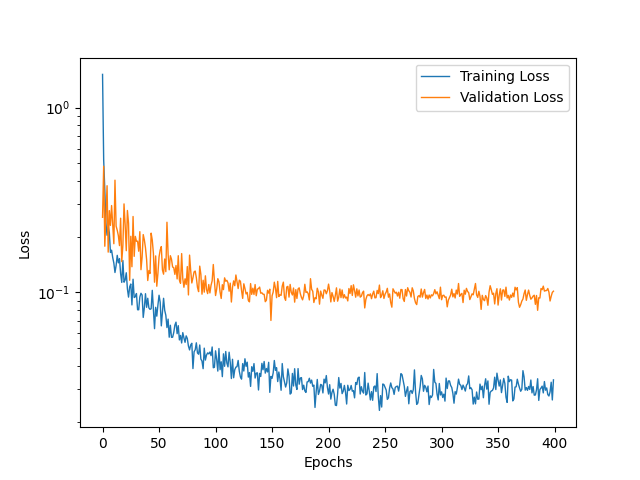

# Models

Validating on: ['23', '48', '38', '1', '80', '22', '27', '36']

---
## 3D Convolution No Age

3D convolutions and linear perceptron. Age of the patient is not used.

```
tio.transforms.RandomAffine(scales=0, degrees=10, translation=0.2, default_pad_value='minimum', p=0.25),
tio.transforms.RandomFlip(axes=(0, 1, 2), flip_probability=0.25),
tio.transforms.RandomAnisotropy(axes=(0, 1, 2), p=0.25),
tio.transforms.RandomNoise(mean=0, std=0.1, p=0.25),
tio.transforms.RandomBlur(std=0.1, p=0.25)
```

### No Residual

Model has 19396225 trainable parameters

2000 epochs. Validation patience of 250 epochs. Batch size 8.

Criterion: MSE Loss
Optimizer: SGD. LR 0.001. WD 0.0001. Mo 0.9. Nesterov.
Scheduler: ReduceLROnPlateau. Mode min. Factor 0.5. Patience 10. Threshold 0.0001.

Results:
Average Loss: 13.39 cc
Standard Deviation: 13.15 cc



### ResNet [3, 3, 3, 3]

Model has 66657601 trainable parameters.

2000 epochs. Validation patience of 250 epochs. Batch size 8.

Criterion: MSE Loss
Optimizer: SGD. LR 0.001. WD 0.0001. Mo 0.9. Nesterov.
Scheduler: ReduceLROnPlateau. Mode min. Factor 0.5. Patience 10. Threshold 0.0001.


---
## 3D Convolution Age

### No Residual

Model has 19396738 trainable parameters.

2000 epochs. Validation patience of 250 epochs. Batch size 8.

Criterion: MSE Loss
Optimizer: SGD. LR 0.001. WD 0.0001. Mo 0.9. Nesterov.
Scheduler: ReduceLROnPlateau. Mode min. Factor 0.5. Patience 10. Threshold 0.0001.


### ResNet [3, 3, 3, 3]

Model has 66658114 trainable parameters.

2000 epochs. Validation patience of 250 epochs. Batch size 8.

Criterion: MSE Loss
Optimizer: SGD. LR 0.001. WD 0.0001. Mo 0.9. Nesterov.
Scheduler: ReduceLROnPlateau. Mode min. Factor 0.5. Patience 10. Threshold 0.0001.


---
