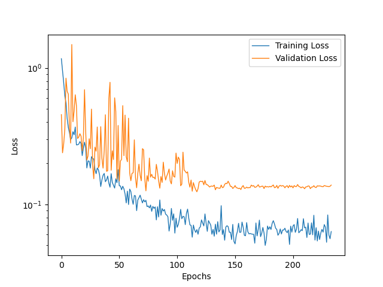
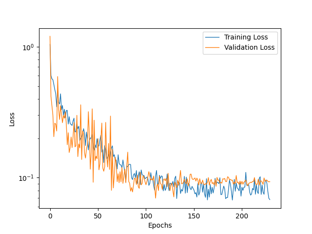
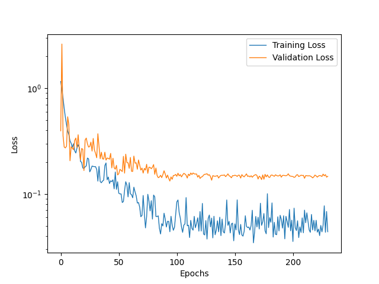
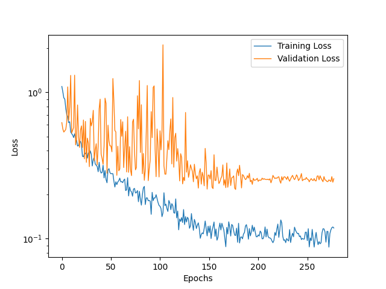
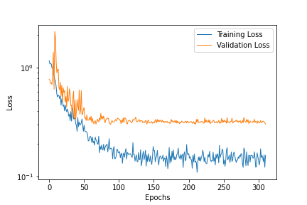
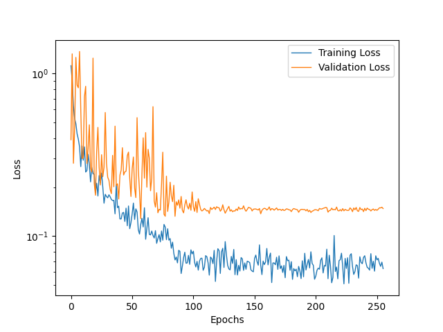

# :star: Models

This project predicts TBV (and age) of patients with 3 different architectures:
- Simple and shallow 3D CNN.
- 3D ResNet-30.
- 3D SIFT-CNN.

Validating on patients '23', '48', '38', '1', '80', '22', '27' and '36'.
K-folds is reserved only for the final chosen architecture.

All models are trained on 1000 epochs, with a validation patience of 100 epochs. Batch size 8.
The first 125 epochs are ignored due to validation score volatility.

The dataset is augmented in runtime using the following pipeline:
```
tio.transforms.RandomAffine(scales=0, degrees=10, translation=0.2, default_pad_value='minimum', p=0.25),
tio.transforms.RandomFlip(axes=(0, 1, 2), flip_probability=0.2),
tio.transforms.RandomAnisotropy(axes=(0, 1, 2), p=0.2),
tio.transforms.RandomNoise(mean=0, std=0.1, p=0.2),
tio.transforms.RandomBlur(std=0.1, p=0.2),
tio.transforms.RandomBiasField(p=0.01),
tio.transforms.RandomMotion(num_transforms=2, p=0.01),
tio.transforms.RandomGhosting(num_ghosts=2, p=0.01),
tio.transforms.RandomSwap(p=0.01),
tio.transforms.RandomSpike(p=0.01)
```

</br>

---
# :zero: 3D Convolution No Age

Prediction of the total brain volume purely based on the features extracted by a series of 3D convolution layers.

## :arrow_forward: Simple Net

Results:
- Average difference: 13.15 cc.    
- Standard deviation: 14.75 cc.



## :arrow_forward: ResNet-30

Results:
- Average difference: 10.97 cc.	
- Standard deviation: 11.91 cc.



Average difference TBV: 12.63 cc.       Standard deviation TBV: 10.69 cc.

## :arrow_forward: SIFT-CNN

Results (PREVIOUS):
- Average difference: 13.6 cc.    
- Standard deviation: 16.59 cc.



</br>

---
# :arrow_right: 3D Convolution Age Output

The age of the patient is also predicted along with the volume. It is possible that by doing multivariate regression the model learns quicker due to added information. It didn't quite work, though, as the results were overall worse.

## :arrow_forward: Simple Net

Results:
- Average difference TBV: 13.66 cc.       
- Standard deviation TBV: 14.49 cc.
- Average difference Age: 8.65 days.      
- Standard deviation Age: 7.95 days.



## :arrow_forward: ResNet-30

Results:
- Average difference TBV: 16.27 cc.	
- Standard deviation TBV: 13.8 cc.
- Average difference Age: 9.04 days.	
- Standard deviation Age: 10.73 days.
  


</br>

---
# :arrow_left: 3D Convolution Age Input 

The age of the patient is also inputted in the fully connected layer so that it can modulate the interpretation of the extracted CNN features. The results are basically the same as if we didn't add the age.

## :arrow_forward: Simple Net

Results:
- Average difference TBV: 13.35 cc.       
- Standard deviation TBV: 14.74 cc.



## :arrow_forward: ResNet-30

Results:
- Average difference TBV: 10.73 cc.	
- Standard deviation TBV: 12.92 cc.


</br>

---
# :leftwards_arrow_with_hook: 3D Convolution Prev Scans

The age of the patient and the previous scan results are inputted in the fully connected layer.
Results did not improve, probably due to overfitting, the network now having other data to rely on instead of the original volume processed.

## :arrow_forward: ResNet-30

Results:
- Average difference TBV: 11.47 cc.       
- Standard deviation TBV: 12.66 cc.

